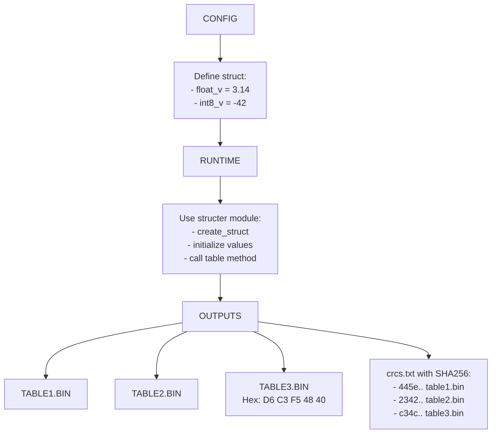

# c-structer.lua

An example of LuaJIT's FFI implemented as a table generation tool. Create a 
runtime around your configs to modify and generate tables for C app/lib 
initialization.

```mermaid
flowchart TD
  CONFIG[CONFIG]
  RUNTIME[RUNTIME]
  OUTPUTS[OUTPUTS]

  CFG[Define struct:\n- float_v = 3.14\n- int8_v = -42]
  CODE[Use structer module:\n- create_struct\n- initialize values\n- call table method]

  BIN1[TABLE1.BIN]
  BIN2[TABLE2.BIN]
  BIN3[TABLE3.BIN\nHex: D6 C3 F5 48 40]
  SHA[crcs.txt with SHA256:\n- 445e.. table1.bin\n- 2342.. table2.bin\n- c34c.. table3.bin]

  CONFIG --> CFG --> RUNTIME
  RUNTIME --> CODE --> OUTPUTS
  OUTPUTS --> BIN1
  OUTPUTS --> BIN2
  OUTPUTS --> BIN3
  OUTPUTS --> SHA
```
