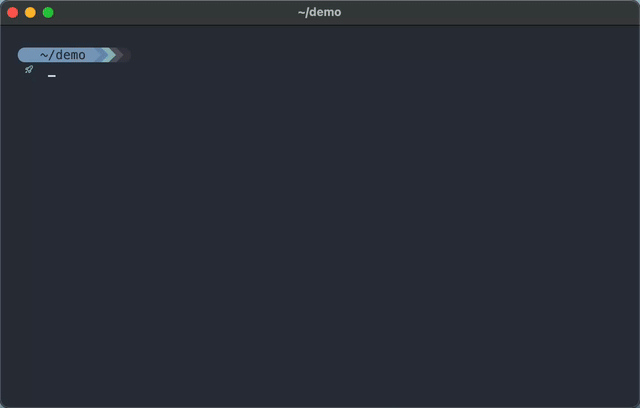

# c-structer.lua

Proof of concept using LuaJIT Foreign Function Interface (FFI) library to both
define and generate C-style tables at run time. Build a flexible runtime around
your config files to create and manipulate structured data for initializing C
applications and libraries.

  

